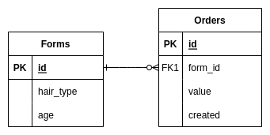

  

---

  <h1>⚗️ JustForYou Data Analysis Challenge</h1>

Primeiramente, obrigado pelo seu interesse em trabalhar na JustForYou! Abaixo você encontrará todas as informações necessárias para iniciar o seu teste.

## 💡 Avisos antes de começar

* Crie um repositório na sua conta do GitHub sem citar nada relacionado a JustForYou;
* Faça seus commits no seu repositório;
* Compartilhe com a justfor-br (username do Github do avaliador rftemer), assim você poderá dar permissão de leitura no código; 
* Fique tranquilo, respire, assim como você, também já passamos por essa etapa. Boa sorte! :)

## ❓ Desafio

### Contextualização
Você trabalha em uma empresa do tipo e-commerce que vende produtos para cabelo personalizados.
A empresa trabalha com todos os tipos de cabelo, mas o seu enfoque e suas propagandas giram em 
torno de resultados para cabelos lisos.
 
A experiência de venda online é baseada em três etapas:
 
<ul>
    <li> Preenchimento de um formulário </li>
    <li> Seleção dos produtos </li>
    <li> Fechamento da compra </li>
</ul>
O formulário tem como intenção conhecer o perfil da(o) cliente e possui duas perguntas:
<ul>
    <li> Qual o tipo de cabelo (liso/ondulado/cacheado/crespo) </li>
    <li> Qual a idade </li>
</ul>

### Problema e desafio
Ao fechar o balanço de vendas dos primeiros 4 meses de 2022, o time de Marketing apontou que 
o mês de Março teve uma queda de aproximadamente 50% nas vendas, e não conseguiu encontrar
a causa ou algo que explicasse tal queda.
 
 
Você então é convocado para solucionar tal desafio, e <b>deve entender o porquê da queda 
de vendas em Março utilizando-se da base de dados de sua empresa.</b>
 
Para isso, acesse o banco para coletar os dados, e use os recursos ao seu alcance para
analisar o problema e apresentar as suas conclusões.

### Recursos
Sua empresa contém um banco de dados relacional (Postgres) hospedado remotamente que contém a seguinte
estrutura de tabelas e relações:

    

 
Você pode escolher as ferramentas de manipulação e análise de dados, porém <b>deve usar a linguagem SQL</b>
para extrair os dados do banco de forma programática.

 

### Entregas
Em um parágrago suscinto, responda as seguintes perguntas:
> 1. Quais as conclusões que se pode tirar para a queda de vendas de Março? </li>
> 2. (Opcional) Existe algum outro padrão nos dados analisados que pode ser útil para a tomada de decisão nos negócios da empresa?

Referencie eventuais imagens geradas por você para embasar as suas conclusões!

 

Devem constar em seu repositório git:
> * Arquivo de texto com o parágrafo descrito acima
> * Arquivo .sql contendo as <i>queries</i> utilizadas para obtenção dos dados
> * Scripts utilizados para análises, caso tenha utilizado algum (exemplo: arquivos .py)
> * Pasta de imagens contendo:
>   * Gráfico de faturamento por mês
>   * Demais gráficos obtidos nas análises
